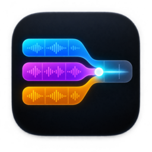
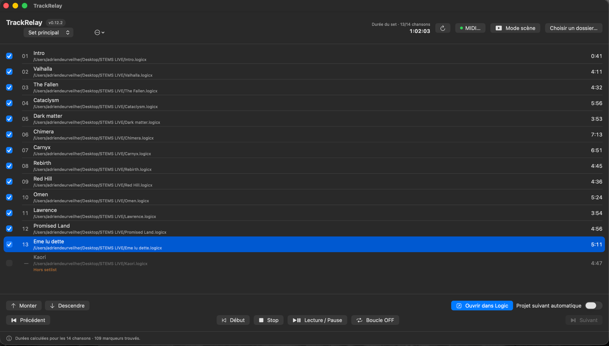
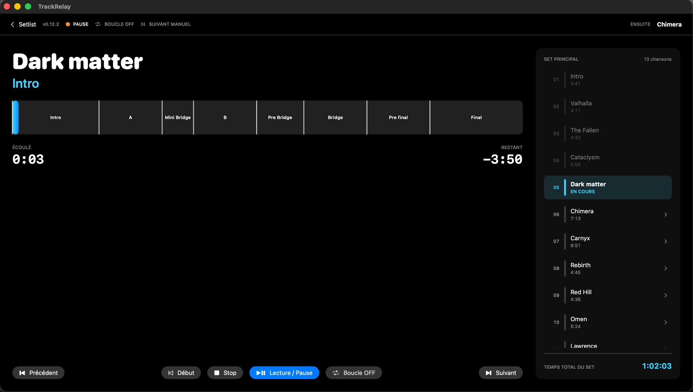
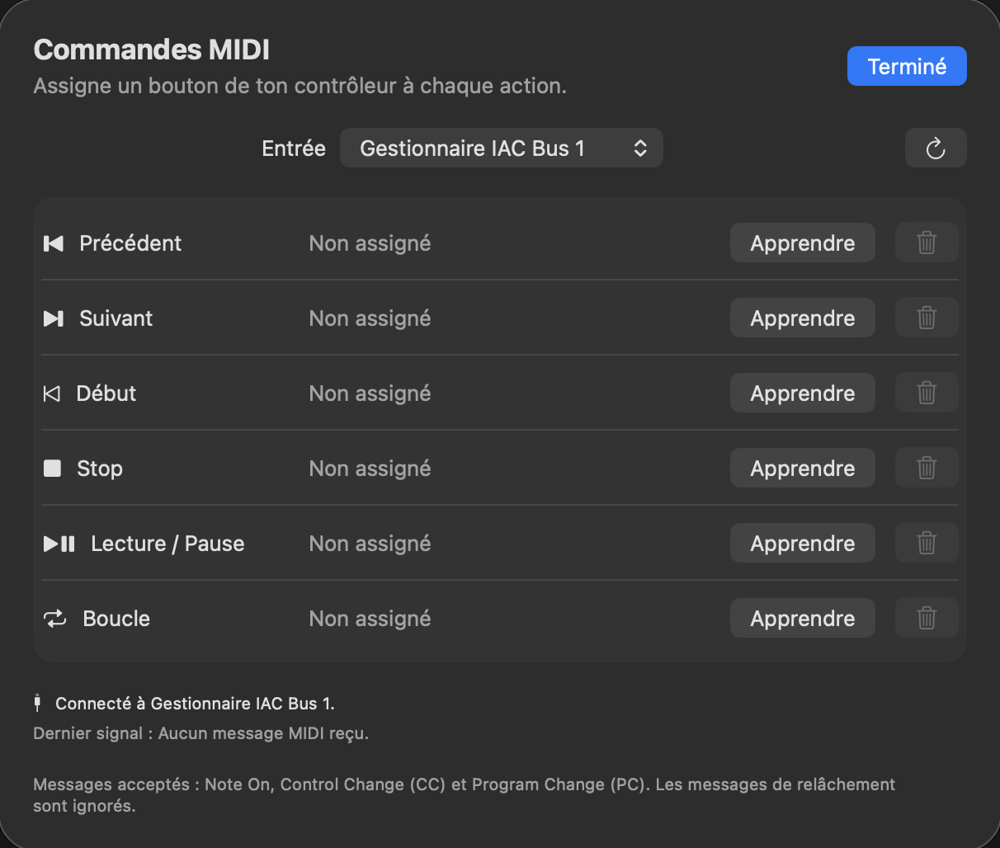
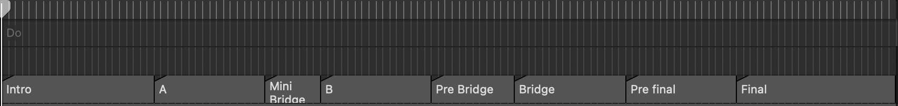

  

<h1 align="center">TrackRelay</h1>

  A native macOS setlist controller for Logic Pro. 
  Keep one Logic project per song and move through a live set from one focused interface.

## Overview

TrackRelay is designed for live performances built around independent Logic Pro
projects. Each song remains in its own `.logicx` project, while TrackRelay manages
their order, opens the right project, controls Logic's transport and provides a
clear stage-oriented display.

The app is particularly useful for projects containing a backing track and MIDI
automation for external equipment, but it does not impose a specific track layout.

TrackRelay is an independent project and is not affiliated with or endorsed by Apple.

## Screenshots

### Setlist management

Create and organize complete shows, include or exclude individual songs and see
the total duration of the active set.

### Scene view

Follow the current song, musical section, progress, remaining time and upcoming
songs from a display designed to remain readable on stage.

### MIDI remote control

Assign controller messages to the main navigation, transport and Cycle commands
with the built-in MIDI Learn interface.

### Logic marker integration

Markers exported from Logic into a project audio file become the musical
sections displayed inside the Scene view progress bar.

## Features

- Discover `.logicx` projects recursively from a selected folder.
- Create, duplicate, rename, delete and switch between multiple setlists.
- Include or exclude individual songs without removing them from the library.
- Reorder songs with drag and drop or the Move Up / Move Down controls.
- Open the previous, selected or next Logic project.
- Return the playhead to the beginning after a project is loaded.
- Control Play/Pause, Stop, Return to Beginning and Cycle mode.
- Learn MIDI Note, Control Change or Program Change messages for remote control.
- Follow Logic's position and playback state through MIDI Time Code (MTC).
- Use a dedicated Scene view with the current song, section, progress, elapsed
  and remaining time, upcoming songs and total set duration.
- Display song sections from markers embedded in the project's audio files.
- Optionally open the next project when Logic reaches the project end and stops.
- Keep the TrackRelay window in front while projects and transport commands are
  sent to Logic.
- Store the library, setlists, MIDI mappings and preferences locally.

## Requirements

- macOS 13 or later.
- Logic Pro.
- Accessibility permission for Logic transport control.
- MTC enabled in each Logic project for position tracking, Scene mode and
  automatic project changes.

TrackRelay has no third-party dependencies.

## Installation

1. Download the latest TrackRelay build from the
   [Releases page](https://github.com/adriendoespostrock/TrackRelay/releases).
2. Move **TrackRelay.app** to the Applications folder.
3. Launch TrackRelay. If macOS blocks the first launch, right-click the app,
   choose **Open**, then confirm.
4. Grant Accessibility permission when using Logic transport controls for the
   first time.

## Preparing the Logic projects

### Project folder

Place the Logic projects for the show inside a common folder. Subfolders are
supported. TrackRelay scans this folder recursively and treats each `.logicx`
project as one song.

For predictable project changes, configure Logic to close the current project
when another project is opened. Projects should not contain unsaved changes,
otherwise Logic may display a save confirmation during the show.

### MIDI Time Code

TrackRelay creates a virtual MIDI destination named **TrackRelay Sync**.

For every Logic project:

1. Open **File > Project Settings > Synchronization > MIDI**.
2. Select **TrackRelay Sync** as a destination.
3. Enable **MTC** for that destination.
4. Save the Logic project.

The setting belongs to the individual Logic project and must therefore be saved
in every song.

### Accessibility permission

TrackRelay sends Logic's standard keyboard shortcuts directly to the Logic process.
On first use, allow the app under:

**System Settings > Privacy & Security > Accessibility**

The default shortcuts used by the app are:

| Action | Logic shortcut |
| --- | --- |
| Play / Pause | Space |
| Stop | Numeric keypad `0` |
| Return to Beginning | Return |
| Cycle | `C` |

Opening and reordering projects do not depend on this permission.

## Setlists

Selecting a project folder creates a song library. Each saved setlist keeps its
own song order, inclusion choices and current selection.

Unchecked songs remain in the library but are excluded from the set duration,
Previous/Next navigation and Scene view. The setlist menu can create an empty
setlist from the current library or duplicate the active setlist.

## MIDI remote control

1. Connect the MIDI controller before launching TrackRelay.
2. Open **MIDI…** and select the input device.
3. Choose **Learn** next to an action.
4. Press the desired button or footswitch.

The following actions can be assigned:

- Previous project
- Next project
- Return to Beginning
- Stop
- Play / Pause
- Cycle on/off

Note On, Control Change and Program Change messages are supported. Release
messages with a value of zero are ignored.

## Scene view

Scene view is designed to remain readable at a distance. It shows the current
song and section, a segmented progress bar, elapsed and remaining time, the
setlist and the total duration of the show.

To display sections, create markers in Logic and export them to an audio file
used by the project. TrackRelay reads the embedded Core Audio markers when song
durations are refreshed. Technical region and file markers are filtered out.

## Song duration

TrackRelay reads audio files stored in the project's `Media/Audio Files` folder
and uses the longest one as the displayed song duration. Logic's internal sample
resources, including metronome files, are ignored.

If the audio is only referenced from an external location, its duration may be
unavailable. Consolidating the Logic project or saving its audio assets inside
the project package makes the duration readable by TrackRelay.

Displayed duration is used for the progress interface and set total. It does not
decide when automatic project switching occurs.

## Automatic next project

When **Automatic Next Project** is enabled, TrackRelay waits until playback has
started and opens the next included song when Logic stops sending MTC at the end
of the project. The original audio file length and named End/Fin markers are not
used for this decision.

Stop and Play/Pause commands sent through TrackRelay or its learned MIDI controls
do not trigger the next project. MTC does not, however, describe why Logic stopped:
pausing or stopping directly inside Logic can therefore look like a project end.

The next project is opened but playback is not started automatically.

## Cycle status

The Cycle indicator reflects commands sent from TrackRelay or its MIDI remote.
Logic does not expose the Cycle state through MTC, so changing Cycle directly in
Logic can leave the indicator out of sync until the next TrackRelay Cycle command.

## Current limitations

- MTC reports position and activity but does not distinguish project end from a
  manual stop performed directly in Logic.
- TrackRelay confirms that an open command was sent; it cannot inspect Logic's
  private loading state directly.
- Song sections require markers embedded in an audio file.
- External audio files are not currently scanned outside the `.logicx` package.
- Transport control assumes Logic's default keyboard shortcuts.

## Data and privacy

TrackRelay works locally. Setlists, MIDI mappings and preferences are stored in
the current macOS user account. The app does not upload project or performance data.

## Author

Created by **Adrien Deurveilher**, guitarist in
[When Waves Collide](https://www.youtube.com/@WhenWavesCollide).

Contributions and issue reports are welcome.
